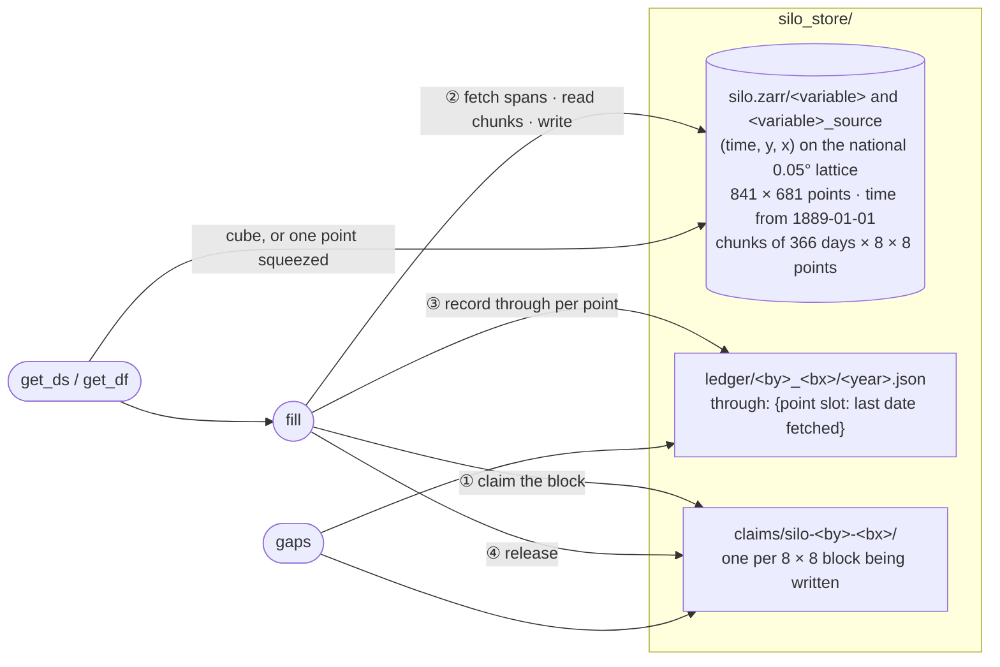
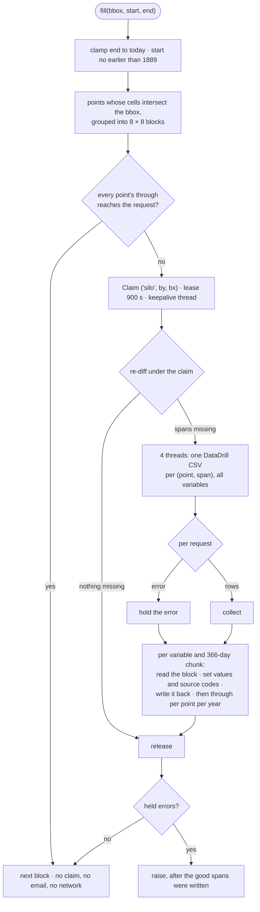

# silo

**Cached [SILO](https://www.longpaddock.qld.gov.au/silo/) daily climate
for Australia — fetch once per grid point-day, never twice.** Every
daily value this machine ever fetches lands in one sparse raster store
on SILO's native 0.05° (~5 km) lattice, so repeat requests, nearby
farms in the same cell, overlapping areas and extended date ranges all
reuse the same values. A bbox gets a real `(time, lat, lon)` cube —
every grid point inside it — not one point standing in for an area.
Part of the [Borevitz Lab](https://biology.anu.edu.au/research/research-groups/borevitz-group-plant-genomics-climate-adaption) ecosystem.

## How it works

```
{tmp_dir}/silo_store/
├── silo.zarr/
│   ├── daily_rain            # sparse (time, y, x) float32 on the national 0.05° lattice
│   ├── daily_rain_source     # uint8 SILO provenance code per value (255 = none)
│   └── max_temp ...          # 18 variables, each with its _source
├── ledger/017_091/2023.json  # per 8×8 block and year: last date fetched per point
└── claims/                   # cross-node mutex dirs, present only during a write
```

- The lattice is SILO's own: 841 × 681 points at exact multiples of
  0.05° (112–154 E, 10–44 S), time axis from 1889-01-01. Any bbox maps
  deterministically to the points whose cells intersect it; a single
  coordinate maps to one point.
- SILO is served point by point: DataDrill returns one CSV per grid
  point per date span, all 18 variables at once. `fill(bbox, start, end)`
  diffs every point of the bbox against the ledger and requests **only
  the missing spans**, four requests at a time; `get_ds` then reads the
  cube, `get_df(lat, lon, ...)` the one-point view.
- Coverage records only what SILO actually returned — if the record
  lags behind a requested recent date, the tail stays uncovered and is
  re-requested next time. `fill` clamps `end` to today.
- The ledger is files, not a database. This branch (`gadi`) runs as many
  PBS jobs on many Gadi nodes against one store on Lustre, where file
  locks are node-local and SQLite is unsafe; see
  [troi/docs/ledger.md](https://github.com/thestochasticman/troi/blob/gadi/docs/ledger.md).
  Each 8 × 8-point block is written under a claim directory, its marker
  is committed by atomic rename, and a crash mid-fetch leaves the span
  unrecorded so the next run re-fetches it.
- **Provenance is kept.** DataDrill returns a `{variable}_source` code
  beside every value (observed at a station, interpolated, deaccumulated,
  ...). The store keeps it in `{variable}_source`, so a consumer can
  tell a measurement from a gridded estimate; ask for it with
  `sources=True`.
- Nothing is ever resampled. `get_ds` returns native points with the
  attrs `crs`, `transform` (six affine numbers of the returned window),
  `nodata` and `native_res_m`, so a consumer can regrid reproducibly.

### The pieces



The unit of the ledger is one **point-year**, recorded inside its
block's marker as the last date SILO actually returned for that point.
The unit of fetching is one DataDrill request per (point, missing date
span), all 18 variables at once. A block is 8 × 8 points, one Zarr
chunk per 366-day time chunk, and it is read, updated and written back
under its claim. Shared primitives and the general protocol are in
[troi/docs/ledger.md](https://github.com/thestochasticman/troi/blob/gadi/docs/ledger.md).

### A fill, step by step



A point-year is complete when its `through` reaches the earlier of 31
December and the clamped request end. If SILO's record lags behind a
recent request, the tail stays uncovered and is asked again next time;
there is no 404 in DataDrill, so there is no `absent/` tree.

### What `gaps()` can say

`gaps(bbox, start, end)` enumerates every (point, year) of the request
and classifies each one whose `through` falls short. It touches no
network.

| status | for a (point, year) |
|---|---|
| `before_product_start` | the year is before 1889 |
| `after_today` | the year starts after today |
| `claimed_in_progress` | another job holds that block's claim right now |
| `never_fetched` | `through` is missing or short (the recorded date is in `detail`); this should be 0 after a fill |

## Usage

The core API is **troi-agnostic** — a bbox (or a coordinate) and dates:

```python
from datetime import date
from pysilo.store import Store

store = Store()   # email from ~/.config/Troi.json, or pass email=...
bbox = [147.30, -35.52, 147.62, -35.10]   # [W, S, E, N]

ds = store.get_ds(bbox, date(2023, 1, 1), date(2023, 12, 31))
ds['daily_rain']                           # (time, lat, lon), every 0.05° point in the bbox
ds = store.get_ds(bbox, start, end, variables=('daily_rain', 'radiation'), sources=True)

df = store.get_df(-33.516, 148.373, date(2023, 1, 1), date(2023, 12, 31))
#    one row per day: date, daily_rain, max_temp, min_temp, radiation,
#    vp, et_short_crop, ... (18 variables); sources=True adds nullable
#    daily_rain_source, ... columns

store.fill(bbox, date(2023, 1, 1), date(2023, 12, 31))   # → 0: nothing left to fetch
```

### Is anything missing?

```python
report = store.gaps(bbox, date(2023, 1, 1), date(2023, 12, 31))
print(report.summary())      # e.g. "63/63 units present"
report.complete              # True: nothing never_fetched or claimed_in_progress
```

`gaps` enumerates every (point, year) of the request and classifies
each incomplete one: `never_fetched` (with the last date fetched, if
any), `claimed_in_progress` (another job is writing that block),
`before_product_start`, `after_today`. No network.

Pipelines that speak the shared `troi.Troi` use the adapters:

```python
ds = store.get_ds_troi(troi)      # the whole bbox
df = store.get_df_troi(troi)      # one point, at the bbox centre
store.fill_troi(troi)             # fills every point of the bbox
```

`download_silo(troi)` remains as a thin wrapper returning the classic
`YYYY-MM-DD`-columned frame.

SILO requires a registration email (sent as the API username) — set
`email` in `~/.config/Troi.json`, `TROI_EMAIL`, or pass
`email=` per call.

## Performance

Live measurements against SILO — one grid point, all 18 variables
(a bbox costs one request per point-span inside it, four at a time):

| Scenario | Fetched | Time |
|---|---|---|
| Cold fill — one year (365 days) | 365 days | 0.9 s |
| Same request again | nothing | **0.0 s** |
| Nearby farm, same ~5 km cell | nothing | **0.0 s** |
| Date range extended +6 months | 182 days — *the extension only* | 2.8 s |
| Read cached year (365 × 18) | — | 0.02 s |

Store footprint: **~0.5 MB per point-year** across all variables.
Absolute times vary with network and SILO load; the zeros are the
point — they are marker reads, no network involved.

## Install

### pip

```bash
pip install pysilo-store     # from PyPI (distribution name pysilo-store, import pysilo)
# or straight from GitHub:
pip install git+https://github.com/thestochasticman/pysilo.git@gadi
```

Dependencies (the `troi` core from its `gadi` branch, plus numpy /
pandas / xarray / zarr ≥ 3) are declared in `pyproject.toml` and
installed automatically. The `gadi` branch (0.3.0+gadi) does not read
the SQLite `silo.db` of earlier versions; point it at a fresh `tmp_dir`.

### From source

```bash
git clone https://github.com/thestochasticman/pysilo.git
cd pysilo
pip install -e .
```

Package design (shared across the lab's packages — no inheritance,
composition only):

- **`Troi`** (from `troi`) — identity: what region, what dates.
- **`SILO`** (`pysilo.silo`) — config: endpoint, comment codes, variables.
- **`Paths`** (`pysilo.paths`) — derived location of the store for a
  given `Config`.
- **`grid`** — the fixed 0.05° lattice, blocks and time axis (pure,
  offline-testable math).
- **`Store`** (`pysilo.store`) — ties them together.

## Test

```bash
# offline (pure math + synthetic store):
python pysilo/grid.py     # True
python pysilo/paths.py    # True
python pysilo/store.py    # True

# live (small real fetches from SILO, incl. dedup assertions):
python pysilo/download_silo.py  # True
```
